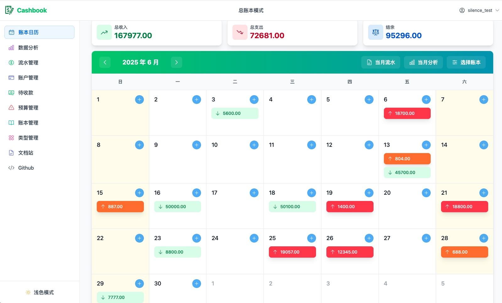
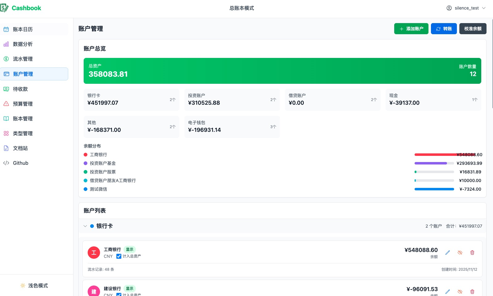
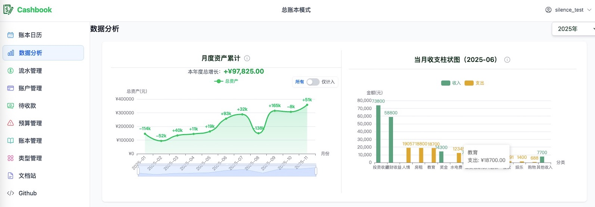
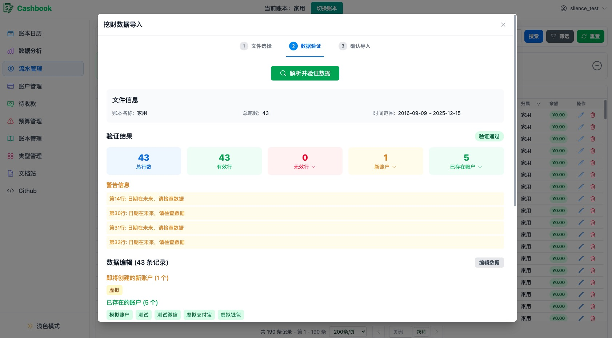
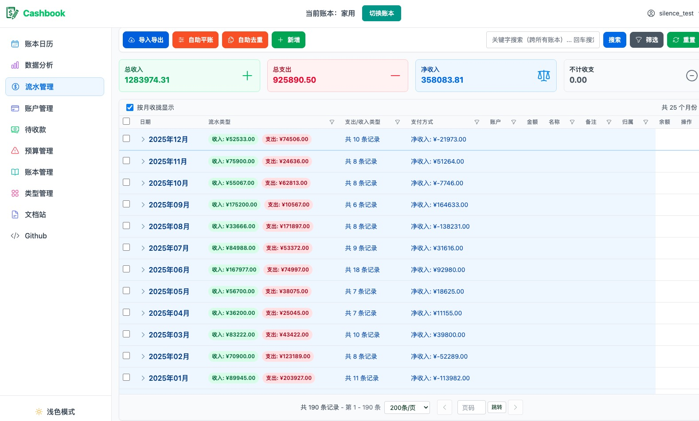

<div align="center" style="display:flex;align-items:center;justify-content:center;">

<h1>Cashbook</h1>
</div>

<p align="center">
  
  
  
</p>
<p align="center">
  
  
  
  
</p>


## 简述（Description）

基于原项目 [dingdangdog/cashbook](https://github.com/dingdangdog/cashbook) 的二次开发改动，之前一直使用随手记进行记账，为了数据安全和功能定制化需求，基于 cashbook 进行了二次开发，重点增强了资产管理概览等核心功能。图表也按照自己的需要重新画了。本项目地址：[silencezhoudev/cashbook-eh](https://github.com/silencezhoudev/cashbook-eh)

## 部署说明

#### 前置要求
- Docker 和 Docker Compose 已安装

#### 快速开始

1. **配置环境变量**

将项目根目录下的 `.env.example` 文件复制为 `.env`，并根据需要修改配置：

```bash
cp .env.example .env
# 编辑 .env 文件，修改数据库密码等配置
```

⚠️ **重要**：生产环境请务必修改所有默认密码！

2. **启动服务**

进入 `docker` 目录，使用 Docker Compose 启动：

```bash
cd docker
docker-compose up -d
```

3. **访问应用**

**首次使用需要先创建账户：**

1. 访问后台管理页面：http://localhost:9090/admin
2. 使用默认管理员账号登录：
   - 用户名：`admin`
   - 密码：`admin`
3. 在后台创建新账户
4. 使用新创建的账户访问前端：http://localhost:9090 进行记账

⚠️ **安全提示**：生产环境请务必修改默认管理员密码！

#### 说明

- **NUXT_DATA_PATH**：应用数据存储路径，用于存储上传的文件（如小票图片等）。在 Docker 容器中默认为 `/app/data`，通过 volumes 映射到宿主机的 `docker/data` 目录。
- **数据库数据**：存储在 `docker/db` 目录
- **应用数据**：存储在 `docker/data` 目录

#### 常用命令

```bash
# 查看日志
docker-compose logs -f main

# 停止服务
docker-compose down

# 停止并删除数据卷（⚠️ 会删除所有数据）
docker-compose down -v
```

## 功能预览（Screenshots）
<details>
<summary>📸 点击展开查看所有截图（静态展示）</summary>

<div align="center" style="display: grid; grid-template-columns: repeat(auto-fit, minmax(300px, 1fr)); gap: 20px; margin-top: 20px;">
  <div>
    <h4>1. 日历</h4>
    
  </div>
  <div>
    <h4>2. 账户</h4>
    
  </div>
  <div>
    <h4>3. 资产分析</h4>
    
  </div>
  <div>
    <h4>4. 收支分析</h4>
    
  </div>
  <div>
    <h4>5. 流水导入</h4>
    
  </div>
  <div>
    <h4>6. 流水收拢</h4>
    
  </div>
</div>
</details>

## 核心功能新增

### 资产管理功能增强 ⭐ **核心增强**
- [x] **计入总资产概念**
- [x] 月度资产累计图增强：
  - [x] 账户筛选开关（所有账户 / 仅计入总资产）
  - [x] 年度增长金额显示
  - [x] 优化计算逻辑（区分收支、转账、借贷）
- [x] 多账本资产统计（支持多账本聚合）

### 账户管理功能 ⭐ **核心新增**
- [x] 账户管理页面
- [x] 账户总览、列表、操作、明细
- [x] 账户间转账功能
- [x] 账户余额校准
- [x] 查看账户流水记录
- [x] **完全独立于账本**（账户是用户级别的全局资源）

### 其他功能增强
- [x] 数据分析页面
  - [x] 支持多账本模式
  - [x] 月度资产累计图增强
  - [x] 多账本月度资产累计图
  - [x] 选中月份收支柱状图
  - [x] 二级支出类型饼图
  - [x] 单级分类账本自动识别为一级分类
  - [x] 年度增长金额显示
  - [x] 图表交互体验优化
- [x] 流水管理页面
  - [x] 支持借贷、转账类型流水
  - [x] 支持随手记导入
  - [x] 批量、筛选功能增强
- [x] 日历页面
  - [x] 多账本日历支持
  - [x] 收支统计增强
  - [x] 月度流水明细支持
- [x] 数据导入功能增强
  - [x] 支持随手记（Wacai）Excel文件导入
  - [x] 账本数据导入验证增强
  - [x] 导入数据冲突检测

## 待完善功能
- [ ] 引入AI 做账单自动分类
- [ ] 资产统计的更多维度分析
- [ ] 更多数据导入格式支持
- [ ] 借贷功能的前端交互优化
- [ ] 多账本功能的性能优化
- [ ] 账户管理功能的批量操作

### 账本依赖情况总结

| 页面/功能 | 是否依赖账本 | 说明 |
|---------|------------|------|
| 账户管理 | ❌ **否** | 账户是用户级别的全局资源 |
| 统一转账管理 | ⚠️ **部分** | 转账记录关联账本，但页面以账户为中心 |
| 流水管理 | ✅ **是** | 所有流水必须关联账本 |
| 数据分析 | ❌ **否** | 单级账本自动升级为一级消费分类 |
| 日历 | ✅ **是** | 支持单账本和多账本模式 |
| 预算管理 | ✅ **是** | 预算关联账本 |
| 待收款管理 | ✅ **是** | 待收款关联账本 |
| 类型管理 | ✅ **是** | 类型配置关联账本 |
| 账本管理 | ✅ **是** | 账本管理页面本身 |


## 版本信息
- **原项目版本**: 4.3.7
- **当前版本**: eh-1.3.13

**重要提示：如果需要部署到公网，请自行修改各类环境变量！！！**  
（如：后台账号密码、数据库密码等）

**最后更新**: 2025-11-12  
**基于原项目**: [dingdangdog/cashbook v4.3.7](https://github.com/dingdangdog/cashbook)
